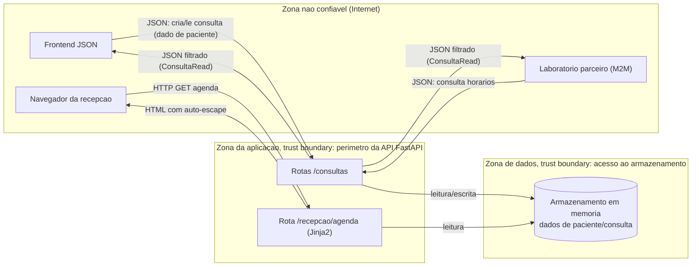

# Exercício 3: CIA e DFD

Análise da aplicação como ela está ao final do Exercício 2 (fundação da API + controle de exposição de dados + template seguro). Os pontos marcados como "gap" são lacunas conhecidas nesta fase do projeto, ainda sem controle implementado.

## 1. Tríade CIA

### Confidencialidade

Dado de saúde é dado sensível sob a LGPD, o que eleva o peso regulatório desse pilar em relação a um CRUD comum.

- **Implementado:** `response_model=ConsultaRead` (Ex2) restringe a saída da API a uma whitelist de campos, impedindo que dados internos de auditoria (`created_by`, `internal_notes`) cheguem ao cliente.
- **Gap:** não existe autenticação nem autorização ainda: qualquer cliente que alcance a API vê os dados de consulta de qualquer paciente.

### Integridade

- **Implementado:** validação de tipo e formato via Pydantic (`paciente_id: int`, `data_hora: datetime`), whitelist de valores via `Enum` (`StatusConsulta`), limites de tamanho em `motivo`. Auto-escape do Jinja2 (Ex2) preserva a integridade do HTML renderizado, impedindo que um dado de paciente injete marcação/script na página vista por outros usuários (recepção).
- **Gap:** não há verificação de quem pode alterar o quê: qualquer cliente pode dar `PUT`/`PATCH`/`DELETE` em qualquer consulta, sem checagem de propriedade (ownership).

### Disponibilidade

- **Implementado:** nada dedicado ainda; a estrutura modular (routes/models/schemas/database) facilita adicionar controles depois sem reescrever a aplicação.
- **Gap:** armazenamento em memória: dado é perdido a cada reinício do processo (risco de disponibilidade dos dados, não do serviço). Também não há rate limiting, então a API está exposta a abuso de requisições.

## 2. Frameworks de referência --- controles concretos

| Framework | Referência | Controle já implementado |
|---|---|---|
| OWASP Top 10 | A03:2021 – Injection (XSS) | Auto-escape do Jinja2 em `agenda.html` (Ex2) |
| OWASP API Security Top 10 | API3:2023 – Broken Object Property Level Authorization | `response_model=ConsultaRead` filtrando campos de saída (Ex2) |
| NIST SSDF | PW.5 – Configurar software com definições seguras por padrão | `autoescape=True` explícito no `Environment` do Jinja2, em vez de depender do default implícito |
| NIST SSDF | PW.4 – Reutilizar software já bem protegido | Uso de Pydantic/FastAPI/Jinja2 (validação e escaping de bibliotecas maduras) em vez de parsing/templating manual |
| MITRE CWE | CWE-200 – Exposure of Sensitive Information to an Unauthorized Actor | `response_model` evitando vazamento de `created_by`/`internal_notes` (Ex2) |
| MITRE CWE | CWE-79 – Improper Neutralization of Input During Web Page Generation (XSS) | Auto-escape do Jinja2 (Ex2) |
| MITRE CWE | CWE-20 – Improper Input Validation | Validação de tipo/enum/tamanho via Pydantic (Ex1) |

Gaps ainda sem controle correspondente: OWASP A01:2021 – Broken Access Control (sem autenticação/autorização), OWASP A05:2021 – Security Misconfiguration (sem CORS/headers de segurança/rate limiting), NIST SSDF PO.3 – Gerenciamento de segredos (sem banco real nem `.env`).

## 3. DFD: trust boundaries e fluxos de dados sensíveis

**Trust boundaries identificadas:**

1. **Perímetro da API** (Internet --- FastAPI): hoje é uma fronteira sem controle de autenticação, qualquer requisição que a atravessa é tratada como confiável pela aplicação. É a fronteira mais crítica em aberto neste ponto do projeto.
2. **Acesso ao armazenamento** (aplicação --- dados): neste momento é uma fronteira fraca porque API e "banco" rodam no mesmo processo Python, sem isolamento real.

**Fluxo de dado sensível em destaque:** o `motivo` da consulta e os identificadores de paciente/profissional atravessam a fronteira da API vindos de três origens diferentes (frontend, recepção, laboratório) e passam por dois caminhos de saída distintos: JSON (para frontend/laboratório) e HTML (para recepção), cada um com seu próprio controle de saída (`response_model` e auto-escape, respectivamente).
