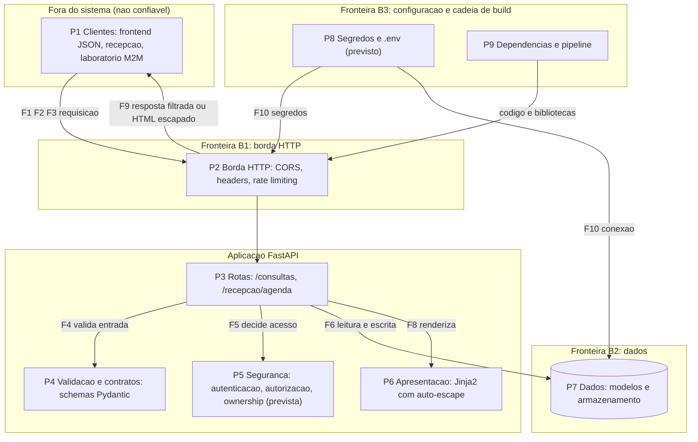

# Exercício 5: Arquitetura de segurança e vetores de ataque

Complementa o threat model (`04_threat_model.md`) com as partições do sistema, as fronteiras de segurança e os vetores de ataque nos três eixos de segurança de APIs. Os IDs T-xx referem-se ao threat model.

## 1. Partições do sistema

| ID | Partição | Responsabilidade |
|---|---|---|
| P1 | Clientes externos | Frontend JSON, navegador da recepção, laboratório (M2M) |
| P2 | Borda HTTP | Entrada das requisições. Ponto único de CORS, cabeçalhos e rate limiting (`app/main.py`) |
| P3 | Rotas | Endpoints `/consultas` e `/recepcao/agenda` (`app/routes/`) |
| P4 | Validação e contratos | Schemas Pydantic de entrada e saída (`app/schemas/`) |
| P5 | Segurança | Autenticação, autorização e ownership (`app/auth/`, prevista) |
| P6 | Apresentação | Templates Jinja2 com auto-escape (`app/templates/`) |
| P7 | Dados | Modelos e armazenamento (`app/models/`, `app/database/`) |
| P8 | Segredos | Variáveis de ambiente e credenciais (`.env`, previsto) |
| P9 | Cadeia de build | Dependências e pipeline (`requirements.txt`, CI) |

## 2. Diagrama e fronteiras

- **B1, Internet para borda HTTP:** todo dado que entra é não confiável.
- **B2, aplicação para dados:** só as rotas, depois de validar e autorizar, acessam os dados.
- **B3, código e dependências para produção:** dependência comprometida ou segredo vazado entram por aqui, sem passar por B1.

## 3. Fluxo de dados

- **F1 a F3 (B1):** frontend, recepção e laboratório enviam requisições à borda. Carregam dado de paciente e tokens.
- **F4 e F5:** as rotas enviam o corpo da requisição para validação (P4) e o token para decisão de acesso (P5).
- **F6 (B2):** as rotas leem e gravam consultas em P7.
- **F7 e F8:** o objeto interno sai filtrado por `ConsultaRead` (JSON) ou escapado pelo Jinja2 (HTML).
- **F9 (B1):** resposta volta ao cliente, sem campos internos.
- **F10 (B3):** segredos e string de conexão chegam à borda e aos dados.

Os fluxos com dado sensível são F1, F6, F7, F8 e F9.

## 4. Vetores de ataque por eixo

### Eixo 1: Design

| ID | Vetor | Ameaça |
|---|---|---|
| V-01 | Sem modelo de autorização definido: qualquer cliente alcança qualquer recurso | T-13, T-21 |
| V-02 | Ids sequenciais em `/consultas/{id}` facilitam varredura | T-14 |
| V-03 | Laboratório sem privilégio mínimo, com acesso parecido ao de usuários internos | T-16, T-17 |
| V-04 | Sem trilha de auditoria de quem alterou o quê | T-11 |

### Eixo 2: Implementação

| ID | Vetor | Ameaça |
|---|---|---|
| V-05 | Busca por id sem verificar o dono do registro (BOLA) | T-07, T-10 |
| V-06 | Schemas de entrada aceitam campos extras (mass assignment) | T-08 |
| V-07 | Campo `motivo` sem validação por whitelist e regex | T-09 |
| V-08 | Dado de usuário renderizado sem escape (XSS stored) | T-19, T-20 |
| V-09 | Senha sem hash forte, JWT sem expiração ou sem verificação de assinatura | T-03, T-04 |

### Eixo 3: Infraestrutura

| ID | Vetor | Ameaça |
|---|---|---|
| V-10 | CORS com wildcard permite que qualquer site use a API no navegador do usuário | T-20 |
| V-11 | Sem HSTS, `X-Frame-Options` e `X-Content-Type-Options` | T-22 |
| V-12 | Sem rate limiting: força bruta no login e flood | T-01, T-12, T-18 |
| V-13 | Credenciais no código ou em `.env` versionado | T-15 |
| V-14 | Dependência vulnerável e pipeline sem análise de segurança | Supply chain |

## 5. Decisões que esta visão orienta

- **Autorização:** V-01, V-02 e V-05 pedem RBAC para os três papéis somados a ownership por recurso.
- **Laboratório:** entra por B1 como cliente de máquina, com credencial e escopo mínimo próprios (V-03).
- **Controles centralizados:** P2 concentra CORS, cabeçalhos e rate limiting. P5 concentra autenticação, autorização e ownership. Isso evita duplicar lógica de segurança nas rotas.
